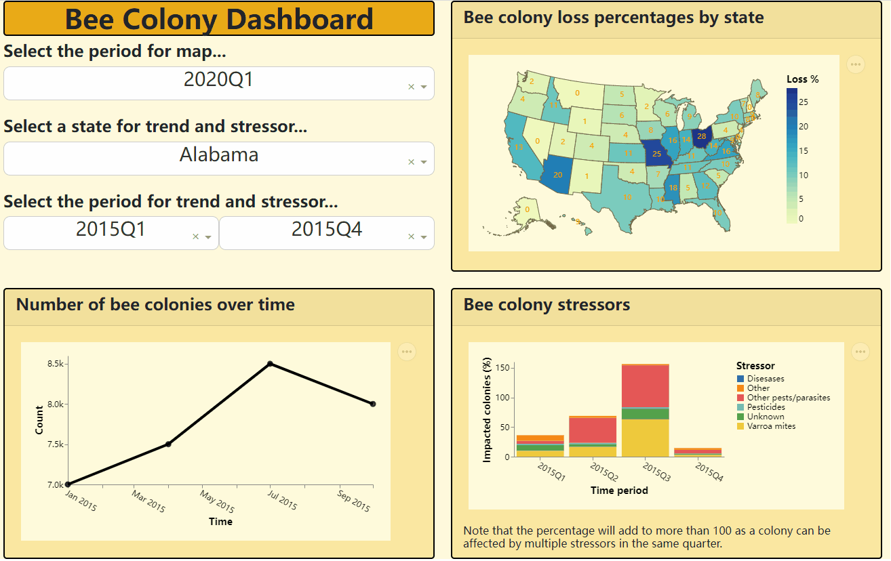
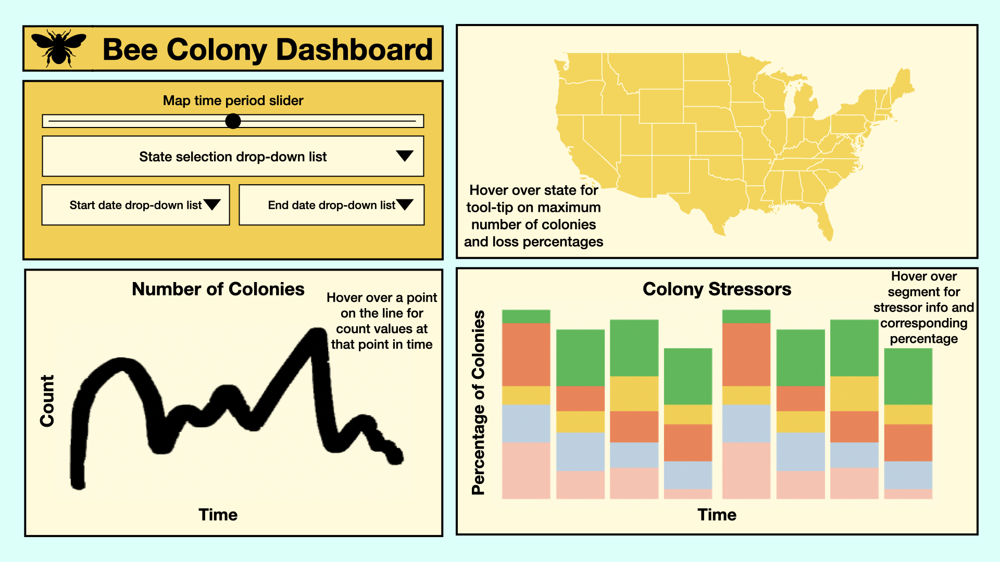

# 🐝 Bee Colony Dashboard

***Providing apiarists with valuable insights into bee colony health***

## Welcome

Thank you for showing interest in the Bee Colony Dashboard! To view the dashboard please click [here](https://bee-colony-dashboard.herokuapp.com).

This README was created to provide you with more information about this project. Use the links below to jump to a section or scroll down.

* [What are we doing?](#overview)
* [Who are we?](#who-are-we)
* [Get involved](#get-involved)
* [Sketch](#sketch)
* [License](#license)

## What are we doing?

### The problem

During the winter of 2006-2007, some beekeepers in America began to report unusually high losses of 30-90 percent of their hives. Bees are one of the most essential components of modern agriculture as a wide variety of flowering plants, including apples and blueberries, require managed pollinators such as bees to ensure continued production. Colony loss has declined since then but is still a concern as bees are vital to the natural ecosystem and our food systems.

### The solution

Easy access to data on declining colony health is therefore necessary to maintaining natural ecosystems and food systems. In particular our dashboard will allow users to visualize and explore the number of colonies, the loss trend, and colony stressors over time in different localities of the United States through a time series plot, a stacked bar chart, and a geographic map.

In the time series plot, the number of colonies of a single state as it varies over a specified period of time is visualized, and by hovering over a point, the user can get an exact value of the number of colonies at a certain quarter of the year. The user can control the state and time period by choosing options through three different dropdown menus.

In the stacked bar chart, the percentage of colonies being affected by different types of colony stressors in a single state, as it varies over a specified period of time is visualized. By hovering over a segment of the bar chart, the user can obtain the exact percentage of colonies being affected by a certain stressor type at a certain quarter of the year. Using the same dropdown menus as the time series plot, the user can control the state and time period that is visualized.

In the geographic map of the United States of America, the user is be able to adjust the time period (measured by quarters of a year) that they are looking at by using a dropdown menu. By hovering over a state, the user can obtain the maximum number of colonies for that time period, as well as the colony loss percentage, measured as the number of lost colonies divided by the maximum number of colonies in that time period.

## Who are we?

The founders of the Bee Colony Dashboard, [Daniel King](https://github.com/danfke), [Manju Neervaram Abhinandana Kumar](https://github.com/manju-abhinandana), [Qingqing Song](https://github.com/scarlqq), and [Tianwei Wang](https://github.com/Davidwang11), are Masters of Data Science students at the University of British Columbia.

## Get involved

If you find a bug or have thought of a way in which our project can improve please refer to our [contributing guidelines](https://github.com/UBC-MDS/Bee_Colony_Dashboard/blob/main/CONTRIBUTING.md). We welcome and recognize all contributions! In addition, if you join us in this project we ask that you follow our [code of conduct](https://github.com/UBC-MDS/Bee_Colony_Dashboard/blob/readme/CONDUCT.md).

## Sketch

The following sketch is what we originally envisioned our dashboard looking like:

## License

`Bee_Colony_Dashboard` was created by Daniel King, Manju Neervaram Abhinandana Kumar, Qingqing Song, and Tianwei Wang. It is licensed under the terms of the MIT license.

## Thank you

Thank you again for showing interest in our project! We hope that you found what you were looking for. Feel free to give us suggestions on how we can improve or any other thoughts on the project.
